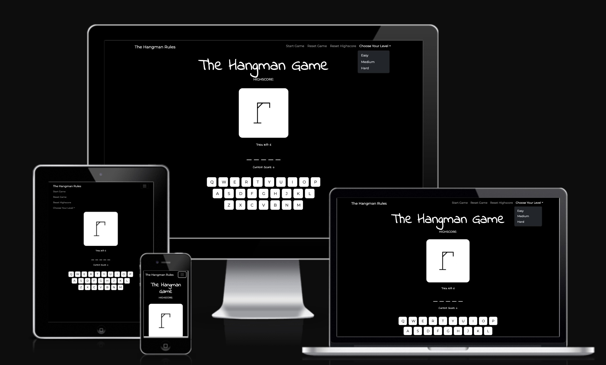

# [hangman](https://karla-stein.github.io/hangman)

Developer: Karla Steinbrink ([Karla-Stein](https://www.github.com/Karla-Stein))

PROJECT INTRODUCTION AND RATIONALE 

Project Title: Hangman – A Classic Word Game reinvented for the Browser

This project is a modern, browser-based implementation of the classic game Hangman. Designed to be interactive, visually engaging and mobile-responsive, the game challenges players to guess hidden words within a limited number of attempts — combining entertainment with vocabulary-building in a fun and intuitive interface. Users interact with an on-screen keyboard, visual hangman graphics, and motivational feedback via modals, sound effects, and celebratory animations. The game tracks high scores using local storage, encouraging replayability and engagement.

The primary aim of this project is to create an engaging and educational game that is accessible to a wide range of users from children learning new words, to adults seeking a quick mental challenge during breaks. The game offers three levels of difficulty (Easy, Medium, Hard), making it suitable for users of varying skill levels. Players can also reset the high score, view detailed rules and switch word banks. All through a responsive and user-friendly interface.

I chose this project because I wanted to bring a nostalgic childhood game into a digital format while applying core JavaScript skills like DOM manipulation, event handling, conditionals, loops and also working with data structures like arrays. I was particularly drawn to the idea of building something both fun and functional, with plenty of room for stretch goals like audio feedback, confetti animations, hints, and different word categories.

As someone transitioning into web development, this project gave me the opportunity to challenge myself technically while building something lighthearted and enjoyable. It also allowed me to deepen my understanding of front-end interactivity and user experience design in a creative context.

source: [hangman amiresponsive](https://ui.dev/amiresponsive?url=https://karla-stein.github.io/hangman)

## UX

### The 5 Planes of UX

#### 1. Strategy

**Purpose**
- Bring the nostalgic, classic game of Hangman into a modern and digital format.
- Create a fun, interactive experience that helps users practice word recognition and memory.
- Provide simple but engaging gameplay with responsive feedback and a choice of difficulty levels to encourage replay.

**Primary User Needs**
- Easily start and play the game without needing instructions, however game rules are available and easily found.
- See clear visual feedback for correct and incorrect guesses.
- Track performance (score and highscore) to stay motivated.
- Select preferred difficulty to match their skill level or mood.

**Business/Project Goals**
- Showcase a JavaScript project using real-world programming concepts like DOM manipulation, conditionals, event listeners, arrays and local storage.
- Demonstrate how gameplay and UX can be enhanced using visual/audio feedback like animations, modals, sound, and confetti.
- Offer a fun, accessible game that could serve educational or entertainment purposes for children and adults alike.

#### 2. Scope

**[Features](#features)** (see below)

**Content Requirements**

- Clear labels for navigation elements (*Start Game*, *Reset Game*, *Choose Difficulty*).  
- Visual representation of tries remaining (hangman image and number of tries).
- Underscore placeholders to show how many letters the word contains.
- On-screen QWERTY keyboard for letter selection.
- Feedback messages via modal dialogs after win or loss.
- Display of current score and highscore for performance tracking.
- Dropdown to select difficulty level (*Easy*, *Medium*, *Hard*).
- Game rules for player that dont know the game.

#### 3. Structure

**Information Architecture**

- **Navigation Menu**:  
  - A simple Bootsrap navbar containing links to *Start Game*, *Reset Game*, *Reset Highscore*, *Game Rules*, and a *Difficulty Dropdown* (Easy, Medium, Hard).  
  - The navbar collapses into a mobile-friendly burger menu on smaller screens.

- **Hierarchy**:  
  - The *game title* and *highscore display* are placed prominently at the top for instant visibility.  
  - The *hangman image section* visually represents progress and sits above the interactive gameplay area.  
  - The *placeholder section* (underscores) clearly shows the word length.  
  - The *tries left* and *current score* indicators are displayed near the guessing area for easy tracking.  
  - The *on-screen keyboard* is centered at the bottom for intuitive interaction.  
  - *Feedback modals* appear above all other elements, providing win/loss updates and rules.

  **User Flow**

1. User lands on the homepage and sees the game title and highscore.
2. Reads game rules (optional) via the navbar link.
3. Selects a difficulty level from the dropdown (Easy, Medium, Hard).
4. Clicks "Start Game" to begin a new round.
5. Guesses letters by clicking the on-screen keyboard.
6. Sees visual feedback:
   - Correct guesses reveal letters.
   - Incorrect guesses reveal hangman parts and reduce tries.
7. Wins by guessing the full word or loses after 6 incorrect tries.
8. Views a modal with win/loss feedback and current score.
9. Game provides a new round with every correct guess.
10. User can choose to start a new round or reset the game/highscore.

