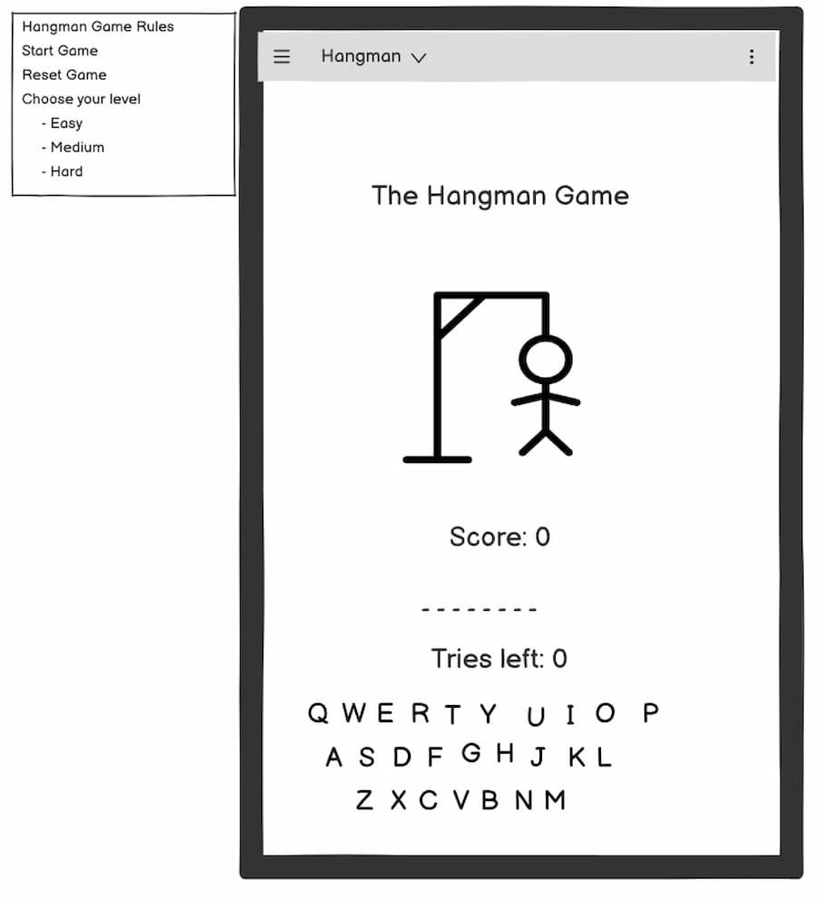
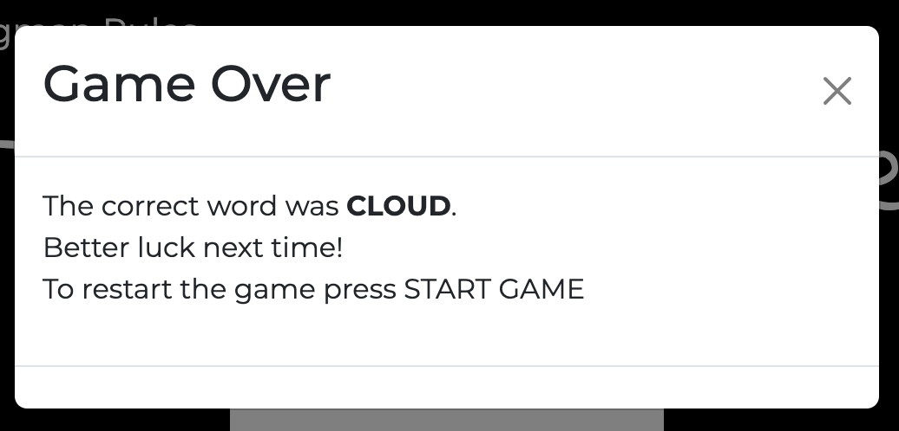

# [hangman](https://karla-stein.github.io/hangman)

Developer: Karla Steinbrink ([Karla-Stein](https://www.github.com/Karla-Stein))

PROJECT INTRODUCTION AND RATIONALE 

Project Title: Hangman – A Classic Word Game reinvented for the Browser

This project is a modern, browser-based implementation of the classic game Hangman. Designed to be interactive, visually engaging and mobile-responsive, the game challenges players to guess hidden words within a limited number of attempts — combining entertainment with vocabulary-building in a fun and intuitive interface. Users interact with an on-screen keyboard, visual hangman graphics, and motivational feedback via modals, sound effects, and celebratory animations. The game tracks high scores using local storage, encouraging replayability and engagement.

The primary aim of this project is to create an engaging and educational game that is accessible to a wide range of users from children learning new words, to adults seeking a quick mental challenge during breaks. The game offers three levels of difficulty (Easy, Medium, Hard), making it suitable for users of varying skill levels. Players can also reset the high score, view detailed rules and switch word banks. All through a responsive and user-friendly interface.

I chose this project because I wanted to bring a nostalgic childhood game into a digital format while applying core JavaScript skills like DOM manipulation, event handling, conditionals, loops and also working with data structures like arrays. I was particularly drawn to the idea of building something both fun and functional, with plenty of room for stretch goals like audio feedback, confetti animations, hints, and different word categories.

As someone transitioning into web development, this project gave me the opportunity to challenge myself technically while building something lighthearted and enjoyable. It also allowed me to deepen my understanding of front-end interactivity and user experience design in a creative context.

source: [hangman amiresponsive](https://ui.dev/amiresponsive?url=https://karla-stein.github.io/hangman)

## UX

### The 5 Planes of UX

#### 1. Strategy

**Purpose**
- Bring the nostalgic, classic game of Hangman into a modern and digital format.
- Create a fun, interactive experience that helps users practice word recognition and memory.
- Provide simple but engaging gameplay with responsive feedback and a choice of difficulty levels to encourage replay.

**Primary User Needs**
- Easily start and play the game without needing instructions, however game rules are available and easily found.
- See clear visual feedback for correct and incorrect guesses.
- Track performance (score and highscore) to stay motivated.
- Select preferred difficulty to match their skill level or mood.

**Business/Project Goals**
- Showcase a JavaScript project using real-world programming concepts like DOM manipulation, conditionals, event listeners, arrays and local storage.
- Demonstrate how gameplay and UX can be enhanced using visual/audio feedback like animations, modals, sound, and confetti.
- Offer a fun, accessible game that could serve educational or entertainment purposes for children and adults alike.

#### 2. Scope

**[Features](#features)** (see below)

**Content Requirements**

- Clear labels for navigation elements (*Start Game*, *Reset Game*, *Choose Difficulty*).  
- Visual representation of tries remaining (hangman image and number of tries).
- Underscore placeholders to show how many letters the word contains.
- On-screen QWERTY keyboard for letter selection.
- Feedback messages via modal dialogs after win or loss.
- Display of current score and highscore for performance tracking.
- Dropdown to select difficulty level (*Easy*, *Medium*, *Hard*).
- Game rules for player that dont know the game.

#### 3. Structure

**Information Architecture**

- **Navigation Menu**:  
  - A simple Bootsrap navbar containing links to *Start Game*, *Reset Game*, *Reset Highscore*, *Game Rules*, and a *Difficulty Dropdown* (Easy, Medium, Hard).  
  - The navbar collapses into a mobile-friendly burger menu on smaller screens.

- **Hierarchy**:  
  - The *game title* and *highscore display* are placed prominently at the top for instant visibility.  
  - The *hangman image section* visually represents progress and sits above the interactive gameplay area.  
  - The *placeholder section* (underscores) clearly shows the word length.  
  - The *tries left* and *current score* indicators are displayed near the guessing area for easy tracking.  
  - The *on-screen keyboard* is centered at the bottom for intuitive interaction.  
  - *Feedback modals* appear above all other elements, providing win/loss updates and rules.

-  **User Flow**

1. User lands on the homepage and sees the game title and highscore.
2. Reads game rules (optional) via the navbar link.
3. Selects a difficulty level from the dropdown (Easy, Medium, Hard).
4. Clicks "Start Game" to begin a new round.
5. Guesses letters by clicking the on-screen keyboard.
6. Sees visual feedback:
   - Correct guesses reveal letters.
   - Incorrect guesses reveal hangman parts and reduce tries.
7. Wins by guessing the full word or loses after 6 incorrect tries.
8. Views a modal with win/loss feedback and current score.
9. Game provides a new round with every correct guess.
10. User can choose to start a new round or reset the game/highscore.

#### 4. Skeleton

**Wire Frames** 

To follow best practice, wireframes were developed for mobile, tablet, and desktop sizes.
I've used [Balsamiq](https://balsamiq.com) to design my site wireframes.

| Mobile | Tablet | Desktop |
| --- | --- | --- |
|  |  |  |

#### 5. Surface

The visual design of the game is intentionally minimalistic.

To enhance user satisfaction and provide a sense of achievement, I included a **confetti animation** when a new high score is reached. This small celebratory detail brings delight to the user and reinforces progress in a fun, memorable way.

**Visual Design Elements**
- **[Colours](#colour-scheme)** (see below)
- **[Typography](#typography)** (see below)

### Colour Scheme

For this project, I intentionally chose a **black-and-white colour scheme** to keep the visual experience clean and distraction-free.

The minimalist aesthetic supports clarity and usability, allowing players to focus entirely on the core objective: guessing the word.  
This approach also enhances accessibility by ensuring high contrast between text, buttons and background elements.

A subtle **soft green accent(#98C379)** was introduced exclusively for the **hint feature**. This colour symbolises **guidance and reassurance**, helping draw attention in a calm and supportive way without breaking the minimalistic aesthetics. 

The overall desing pays homage to the **classic and nostalgic feel** of the traditional hangman game while embracing modern simplicity.

### Typography

Two fonts from [Google Fonts](https://fonts.google.com/) were used to enhance the visual identity of the game:

- [**Indie Flower**](https://fonts.google.com/specimen/Indie+Flower) was used for the primary font, giving the game a playful, handwritten feel that reflects the nostalgic and fun theme of Hangman.
- [**Montserrat**](https://fonts.google.com/specimen/Montserrat) was used as the secondary font for clean, easy-to-read supporting text, such as navigation links, game rules, highscore and buttons.

The combination of these fonts adds a balance between personality and clarity, aligning with the game's overall aesthetic of simplicity and fun.

## User Stories

| Target | Expectation | Outcome |
| --- | --- | --- |
| As a player | I want to see a visual representation of the hangman | So that I can track my progress and understand how many incorrect guesses I have left. |
| As a player |I want to see underscores for each letter in the word | So that I know how many letters I need to guess and see when I get them right. |
| As a player |I want the game to tell me whether my guess is correct or not | So that I can see my progress and adjust my next guess. |
| As a player | I want the game to respond when I guess a wrong letter | So that I understand my mistake and feel the tension of limited chances. |
| As a player | I want to be able to reset the game at any time | So that I can play a new round without refreshing the page. |
| As a player | I want to see my score increase each time I guess a word correctly | So that I feel rewarded and motivated to keep playing. |
| As a player | I want to click on-screen letter buttons to guess the word | So that I can interact with the game without needing a keyboard. |
| As a player | I want a fixed navbar with clearly visible Start and Reset buttons and a place to find the game rules | So that I can easily control the game from one central place. |
| As a player | I want to select a difficulty level before starting the game | So that I can tailor the challenge to match my skill and mood.|
| As a player | I want the game to track my highest score | So that I can try to beat it and feel rewarded when I do. |
| As a player | I want to receive a hint | So that I can get a final chance to guess the word correctly. |
| As a player | I want to be able to use my physical keyboard to guess the letters | So that I can interact with the game more intuitively. |
| As a website visitor | I want to be automatically redirected to the homepage when I enetr a wrong or broken URL | So that I don't get stuck on an error page or have to use the browsers back button.

### Existing Features

| Feature | Notes | Screenshot |
| --- | --- | --- |
| Responsive Navbar | A fixed-top navigation bar gives users quick access to all essential controls: **Start Game**, **Reset Game**, **Reset Highscore** and **Game Rules**. Fully responsive across devices.|  |
| Game Rules Modal | A modal link within the navbar clearly explains how to play.|  |
| Start Button | Starts the game including the score, selected word, and visuals. To be used for starting or starting over from scratch.|  |
| Reset Button | Resets the current round (word and tries) but preserves the current score. |  |
| Difficulty Selection | Players can select between **Easy**, **Medium**, or **Hard** levels before starting or in between games. Each level uses a unique word bank to match the difficulty. |  |
| Highscore Tracker | Tracks and saves the user’s best performance using localStorage. Displayed in the interface to encourage replay and improvement. Triggers Confetti animation once new highscore is hit.|  |
| Highscore storage | Highscore is stored in local storage to ensure the user can attempt to beat their previous best score. | 
| Current score counter | Shows how many words have been successfully guessed in the current session. Resets only with the Start button or when game over. |  |
| Highscore modal | A new highscore triggers a modal to congratulate to the new highscore and provides rewarding feedback alongside confetti animation | 
| Hangman visuals | A hangman image updates step-by-step with each incorrect guess. Once fully drawn, the game ends. |  |
| Tries Left Display | A dynamic counter shows the remaining number of incorrect guesses, building suspense and keeping users aware of their progress. |  |
| Placeholder Word Display | Underscores represent each letter in the hidden word. Correct guesses dynamically reveal letters, offering immediate feedback. |  |
| Virtual Keyboard| Players interact via an on-screen A–Z keyboard, which disables letters after use. Physical keyboard input is also supported for accessibility.|  |
| Hint Prompt | When only one try remains, a green hint prompt appears. Clicking it opens a modal. | |
| Hint modal | Modal displaying a hint for the current word. This gives the player a final lifeline. | 
| Victory Modal | A modal pops up when the user correctly guesses the word, showing a congratulatory message. |  |
| Game Over Modal | If all tries are used without guessing the word, a “Game Over” modal appears, revealing the correct word. User must now **Start Game** to play again. |  |
| 404 Redirect Page | If a user visits a broken or non-existent link, a custom 404 page is shown with a hangman image, error message and a countdown redirect back to the homepage. This ensures no dead ends in the user experience. |  |

### Future Features

- **Dark / Light mode toggle**: Give users the option to switch between dark and light themes for better accessibility and personal preference.
- **Random word API integration**: Replace the static word banks with an external API to fetch fresh, unpredictable words for each game, keeping novelty of the game and improving variety.

## Tools & Technologies

| Tool / Tech | Use |
| --- | --- |
|  | Generate README and TESTING templates. |
|  | Version control. (`git add`, `git commit`, `git push`) |
|  | Secure online code storage. |
|  | Local IDE for development. |
|  | Main site content and layout. |
|  | Design and layout. |
|  | User interaction on the site. |
|  | Hosting the deployed front-end site. |
|  | Front-end CSS framework for modern responsiveness and pre-built components. |
|  | Automated JavaScript testing. |
|  | Creating wireframes. |
|  | Help debug, troubleshoot, and explain things. |
|  | Tutorials/Reference Guide |
|  | Troubleshooting and Debugging |
| | Used to edit hangman images |
|  | Resize images |
|  | Confetti animation |
|  | Favicon |

## Agile Development Process

### GitHub Projects

[GitHub Projects](https://www.github.com/Karla-Stein/hangman/projects) 
**GitHub Projects** was used to manage the project with an Agile, user-focused approach. A visual **Kanban board** helped break down tasks, track progress and maintain momentum throughout development.  
This workflow ensured that features stayed aligned with real user needs, reduced the risk of scope creep, and supported the delivery of a focused MVP without unnecessary complexity.

### MoSCoW Prioritization

To stay focused and prevent overwhelm, I used the **MoSCoW method** to organize and prioritize tasks within my GitHub Project board.  
Larger development goals (EPICs) were broken down into smaller, actionable **user stories**, then grouped by priority to guide the workflow.

This approach made it easy to identify what truly mattered for the initial build and what could be refined later.

**Prioritization breakdown:**
- **Must Have** – Core, non‑negotiable features essential for the game to function.  
- **Should Have** – Features that add strong value but aren’t critical for a working MVP.  
- **Could Have** – Nice‑to‑have enhancements with minimal impact if postponed.  
- **Won’t Have (for now)** – Features planned for future updates once my technical skills advance.

Using this method kept the project scope realistic, ensuring I built a fully functional and polished MVP without losing focus on the essentials.

## Testing

> **Note:** For detailed testing evidence and validation results, see the [TESTING.md](TESTING.md) file.

## Deployment

### GitHub Pages

The site was deployed to GitHub Pages. The steps to deploy are as follows:

- In the [GitHub repository](https://www.github.com/Karla-Stein/hangman), navigate to the "Settings" tab.
- In Settings, click on the "Pages" link from the menu on the left.
- From the "Build and deployment" section, click the drop-down called "Branch", and select the **main** branch, then click "Save".
- The page will be automatically refreshed with a detailed message display to indicate the successful deployment.
- Allow up to 5 minutes for the site to fully deploy.

The live link can be found on [GitHub Pages](https://karla-stein.github.io/hangman).

### Local Development

This project can be cloned or forked in order to make a local copy on your own system.

#### Cloning

You can clone the repository by following these steps:

1. Go to the [GitHub repository](https://www.github.com/Karla-Stein/hangman).
2. Locate and click on the green "Code" button at the very top, above the commits and files.
3. Select whether you prefer to clone using "HTTPS", "SSH", or "GitHub CLI", and click the "copy" button to copy the URL to your clipboard.
4. Open "Git Bash" or "Terminal".
5. Change the current working directory to the location where you want the cloned directory.
6. In your IDE Terminal, type the following command to clone the repository:
	- `git clone https://www.github.com/Karla-Stein/hangman.git`
7. Press "Enter" to create your local clone.

Alternatively, if using Ona (formerly Gitpod), you can click below to create your own workspace using this repository.

**Please Note**: in order to directly open the project in Ona (Gitpod), you should have the browser extension installed. A tutorial on how to do that can be found [here](https://www.gitpod.io/docs/configure/user-settings/browser-extension).

#### Forking

By forking the GitHub Repository, you make a copy of the original repository on our GitHub account to view and/or make changes without affecting the original owner's repository. You can fork this repository by using the following steps:

1. Log in to GitHub and locate the [GitHub Repository](https://www.github.com/Karla-Stein/hangman).
2. At the top of the Repository, just below the "Settings" button on the menu, locate and click the "Fork" Button.
3. Once clicked, you should now have a copy of the original repository in your own GitHub account!

### Local vs Deployment

There are no remaining major differences between the local version when compared to the deployed version online.

## Credits

### Content & Design Inspiration

I wanted to create a project that would allow me to focus primarily on **JavaScript functionality** rather than heavy HTML or CSS work.
This Hangman game was chosen because it offered the perfect opportunity to apply logic-based thinking, DOM manipulation, conditionals, loops and state management.
While I kept the layout minimal and intentionally simple, the focus was on building a fully interactive experience where functionality came first.

### README & Documentation

- The overall structure, formatting and flow of this README were guided by my mentor, Tim Nelson, whose input helped shape a clear and professional documentation style throughout.

### Code References & Tutorials

- **Code Institute** - JavaScript structure and DOM handling strategies were informed by course material and the love-maths walkthrough project. Course materials were especially helpful in installing and configuring Jest for unit testing.
- **MDN Web Docs** - Used as the primary reference for JavaScript, HTML and accessibility guidelines.
- **W3Schools** - Occasionally referenced for syntax examples.
- **Stack Overflow** - Used sparingly to troubleshoot specific issues, such as DOM manipulation quirks or event listener bugs.
- **ChatGPT** - Used to quickly resolve development issues and clarify technical concepts.
- **Mentor Tim Nelson** - Helped with structuring and writing unit tests using Jest to validate DOM interactions and game behavior.

### Tools & Resources

- [**Bootstrap 5**](https://getbootstrap.com) – Used for responsive design, modals and navigation styling.
- [**Canvas Confetti**](https://www.jsdelivr.com/package/npm/canvas-confetti) - Library script source for confetti animation. 
- [**Canvas Confetti**](https://www.kirilv.com/canvas-confetti/) – Used for celebrating highscores in a fun and visual way.
- [**Flaticon**](https://www.flaticon.com) – Source of the favicon and visual assets for the game.
- [**Google Fonts**](https://fonts.google.com) – Used to import custom fonts for headings and body text.
- [**Canva**](https://www.canva.com) – Used to edit the hangman visuals.
- [**GitHub Projects**](https://github.com/Karla-Stein/hangman/projects) – Used for Agile-style development with user stories tracked via Kanban board.
- [**Jest**](https://jestjs.io) – JavaScript testing framework used for unit testing logic functions.
- [**Balsamiq**](https://balsamiq.com) - Early-stage wireframe creation. 
- [**Squoosh**](https://squoosh.app/) - Used for resizing hangman Images.

### Media

- Images
    - [Flaticon](https://www.flaticon.com/free-icons/hangman)

- Image edits
    - [Canva](https://www.canva.com/design/DAGzhydVR9g/Wjq4jgokPWmgcFByht3Jpg/view?utm_content=DAGzhydVR9g&utm_campaign=designshare&utm_medium=link&utm_source=publishsharelink&mode=preview)

- Image Compression
    - [Squoosh](https://squoosh.app/) 

### Acknowledgements

I would like to first and foremost thank my Code Institute mentor, [Tim Nelson](https://github.com/TravelTimN), who has been a tremendous source of knowledge and support throughout this course so far.  
His ongoing guidance, patience and clear explanations have been invaluable.

I would also like to thank [Code Institute](https://codeinstitute.net) for providing structured, comprehensive and well-paced learning materials that built the foundation for this project.  

