# Testing 

> **Note:** Return to the [README](README.md) for full project context.

## Code Validation

### HTML

I have used the recommended [HTML W3C Validator](https://validator.w3.org) to validate all of my HTML files.

| Directory | File | URL | Screenshot | 
| --- | --- | --- | --- | 
|  Home | [index.html](https://github.com/Karla-Stein/hangman/blob/main/index.html) | [HTML Validator](https://validator.w3.org/nu/?doc=https%3A%2F%2Fkarla-stein.github.io%2Fhangman%2Findex.html) | 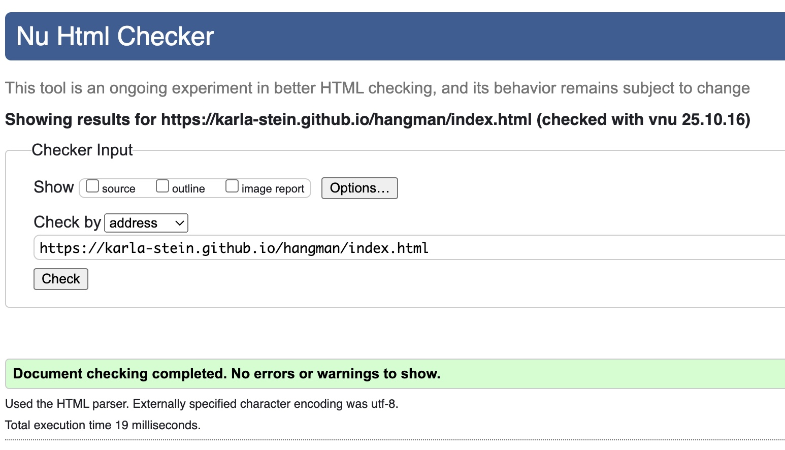 |
|  404 | [404.html](https://github.com/Karla-Stein/hangman/blob/main/404.html) | [HTML Validator](https://validator.w3.org/nu/?doc=https%3A%2F%2Fkarla-stein.github.io%2Fhangman%2F404.html) | 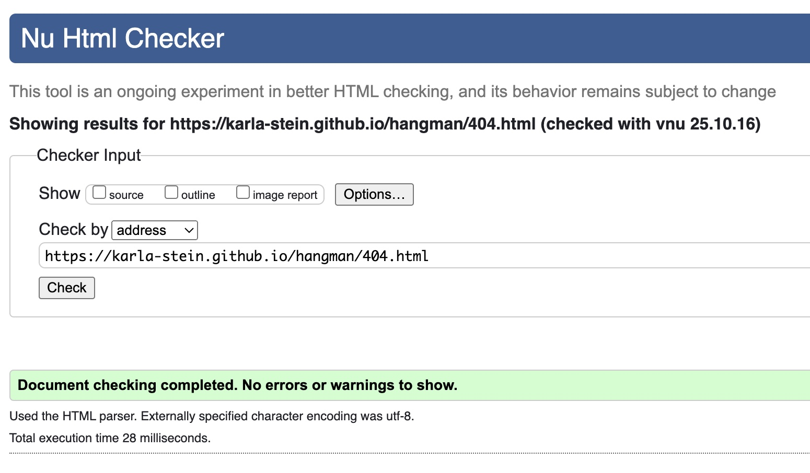 | 

### CSS

I have used the recommended [CSS Jigsaw Validator](https://jigsaw.w3.org/css-validator) to validate all of my CSS files.

| Directory | File | URL | Screenshot | Notes
| --- | --- | --- | --- | --- |
| assets | [style.css](https://github.com/Karla-Stein/hangman/blob/main/assets/css/style.css) | [CSS Validator](https://jigsaw.w3.org/css-validator/validator?uri=https%3A%2F%2Fkarla-stein.github.io%2Fhangman%2Fassets%2Fcss%2Fstyle.css&profile=css3svg&usermedium=all&warning=1&vextwarning=&lang=en) | 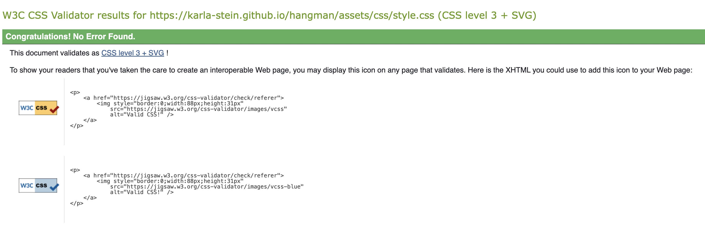 | During CSS validation, minor warnings appeared related to the Google Fonts @import statement. These warnings are common when using external font libraries, do not impact the functionality or rendering of the site and are out of my control.

### JavaScript

I have used the recommended [JShint Validator](https://jshint.com) to validate all of my JS files.

| Directory | File | Screenshot | 
| --- | --- | --- |
| assets | [redirect404.js](https://github.com/Karla-Stein/hangman/blob/main/assets/js/redirect404.js) | 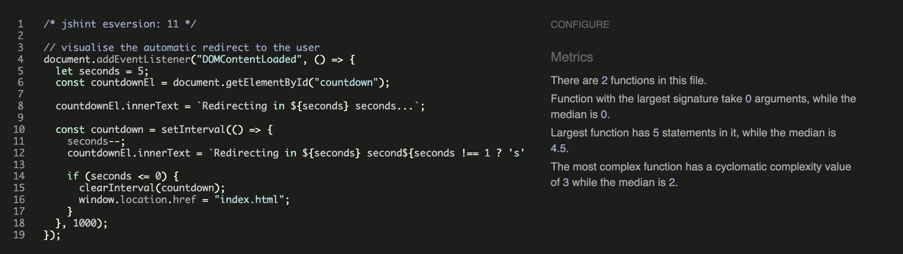 | 
| assets | [script.js](https://github.com/Karla-Stein/hangman/blob/main/assets/js/script.js) | 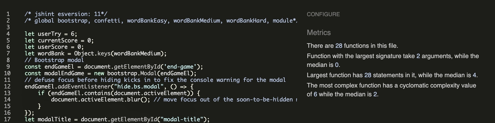 | 
| assets | [game.test.js](https://github.com/Karla-Stein/hangman/blob/main/assets/js/tests/game.test.js) |  | 
| assets | [words.js](https://github.com/Karla-Stein/hangman/blob/main/assets/js/words.js) | 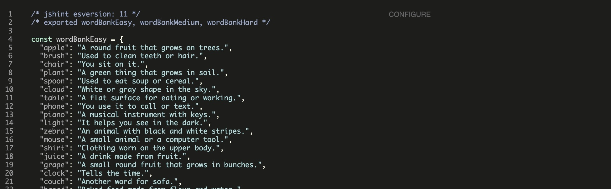 | 

## Responsiveness

I've tested my deployed project to check for responsiveness issues.

| Page | Mobile | Tablet | Desktop | Notes |
| --- | --- | --- | --- | --- |
| Home | 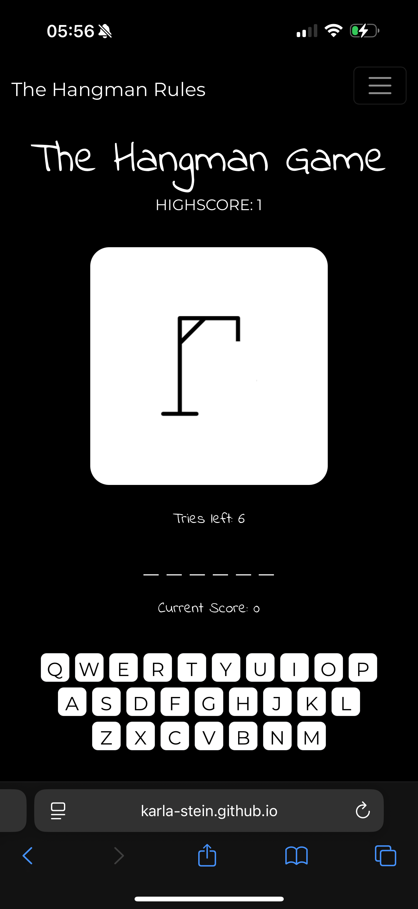 | 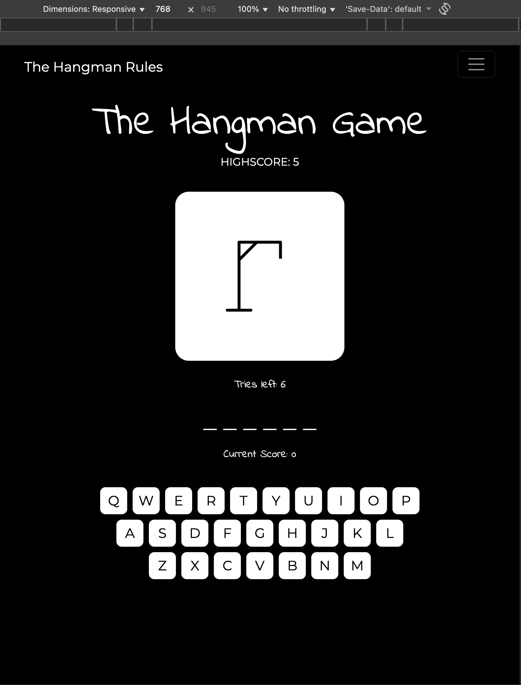 | 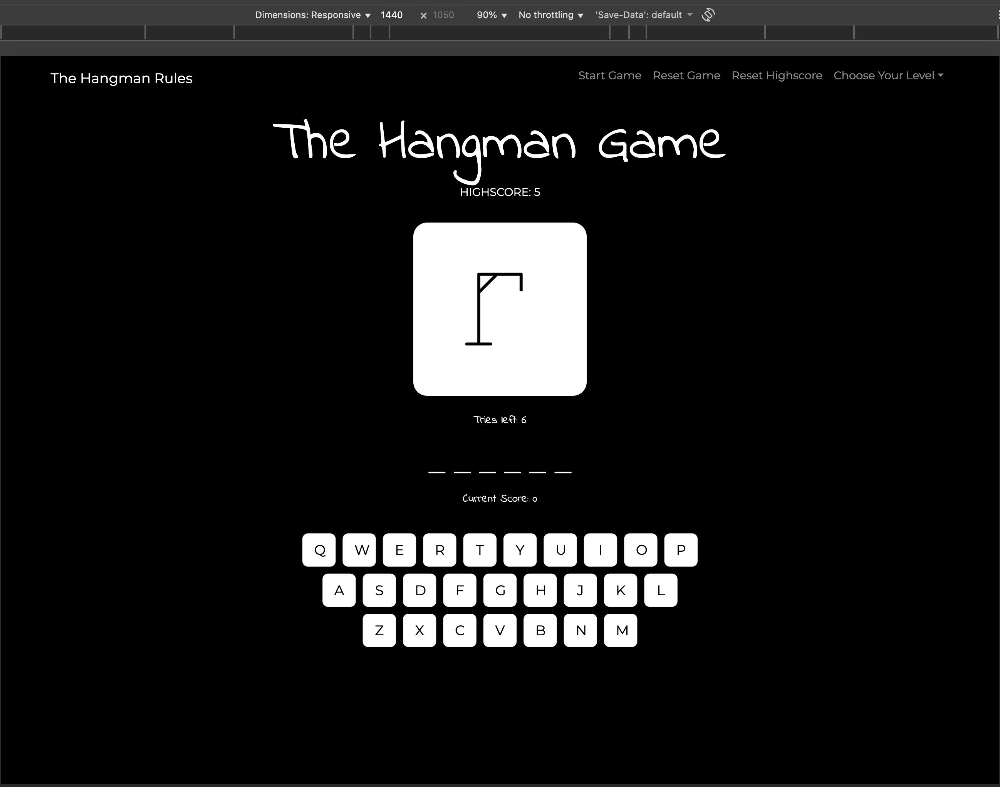 | Works as expected |
| 404 | 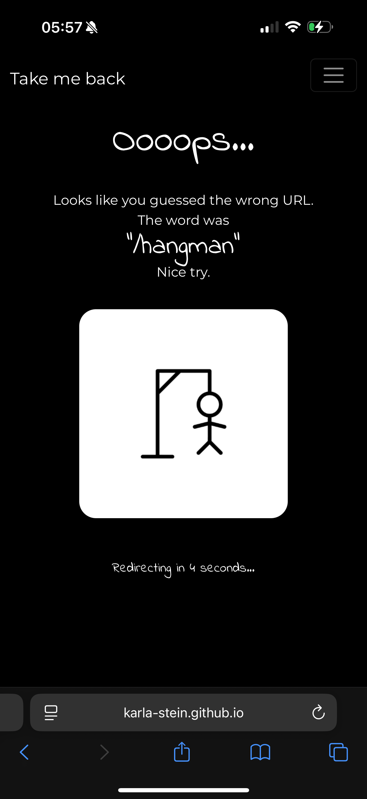 | 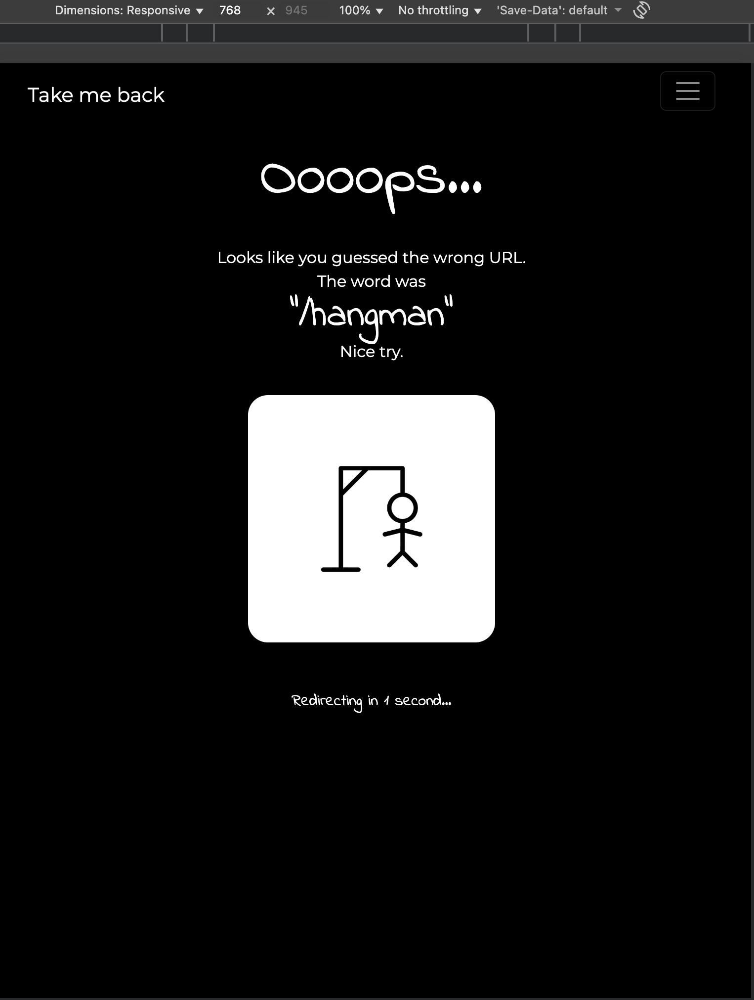 | 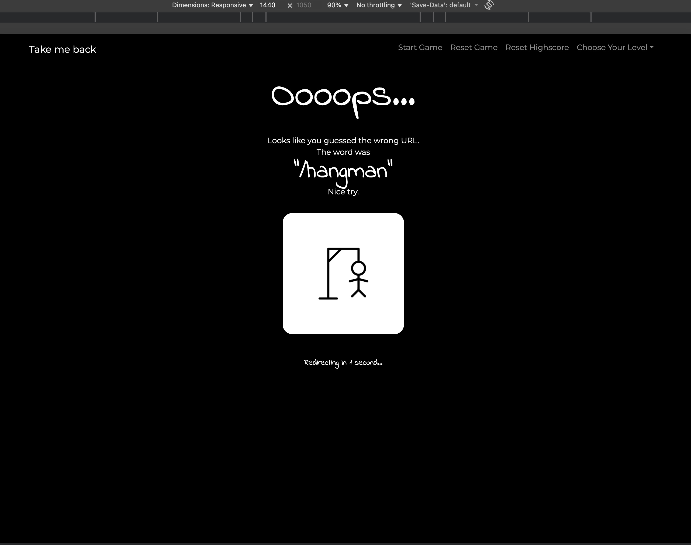 | Works as expected |

## Browser Compatibility

I've tested my deployed project on multiple browsers to check for compatibility issues.

| Page | Chrome | Firefox | Safari | Notes |
| --- | --- | --- | --- | --- |
| Home | 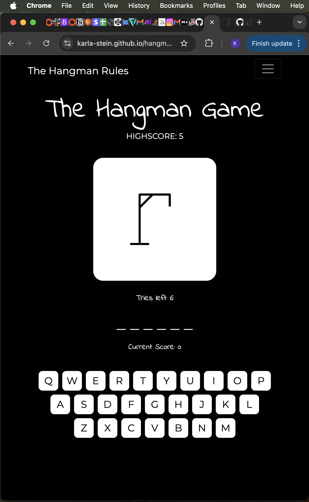 | 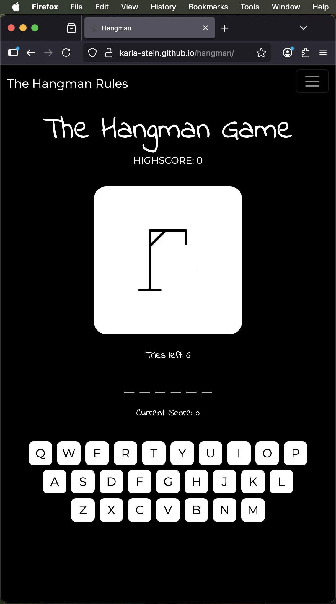 |  | Works as expected |
| 404 | 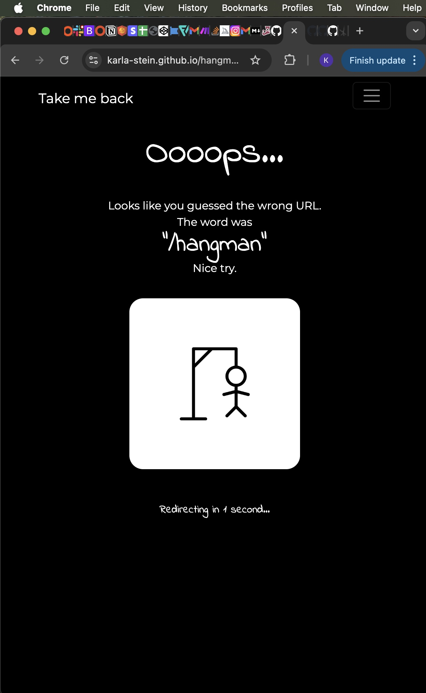 | 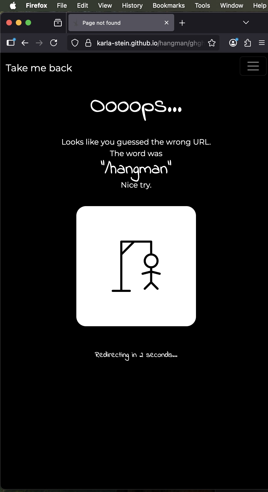 |  | Works as expected |

## Lighthouse Audit

I've tested my deployed project using the Lighthouse Audit tool to check for any major issues. Some warnings are outside of my control, and mobile results tend to be lower than desktop.

| Page | Mobile | Desktop |
| --- | --- | --- |
| Home | 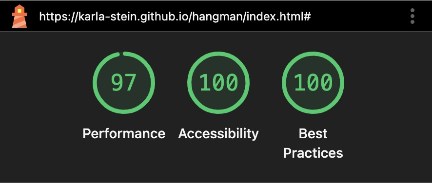 | 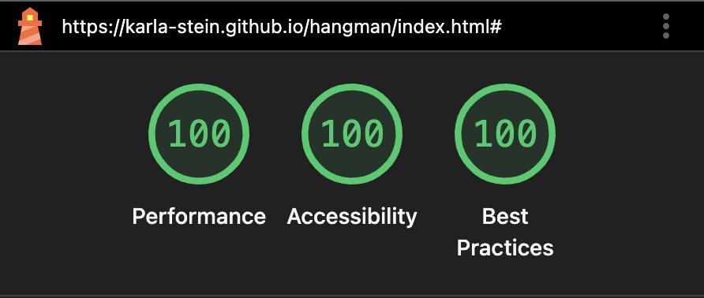 |
| 404 |  |  |
