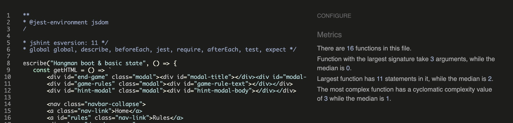

# Testing 

> **Note:** Return to the [README](README.md) for full project context.

## Code Validation

### HTML

I have used the recommended [HTML W3C Validator](https://validator.w3.org) to validate all of my HTML files.

| Directory | File | URL | Screenshot | 
| --- | --- | --- | --- | 
|  Home | [index.html](https://github.com/Karla-Stein/hangman/blob/main/index.html) | [HTML Validator](https://validator.w3.org/nu/?doc=https%3A%2F%2Fkarla-stein.github.io%2Fhangman%2Findex.html) |  |
|  404 | [404.html](https://github.com/Karla-Stein/hangman/blob/main/404.html) | [HTML Validator](https://validator.w3.org/nu/?doc=https%3A%2F%2Fkarla-stein.github.io%2Fhangman%2F404.html) |  | 

### CSS

I have used the recommended [CSS Jigsaw Validator](https://jigsaw.w3.org/css-validator) to validate all of my CSS files.

| Directory | File | URL | Screenshot | Notes
| --- | --- | --- | --- | --- |
| assets | [style.css](https://github.com/Karla-Stein/hangman/blob/main/assets/css/style.css) | [CSS Validator](https://jigsaw.w3.org/css-validator/validator?uri=https%3A%2F%2Fkarla-stein.github.io%2Fhangman%2Fassets%2Fcss%2Fstyle.css&profile=css3svg&usermedium=all&warning=1&vextwarning=&lang=en) |  | During CSS validation, minor warnings appeared related to the Google Fonts @import statement. These warnings are common when using external font libraries, do not impact the functionality or rendering of the site and are out of my control.

### JavaScript

I have used the recommended [JShint Validator](https://jshint.com) to validate all of my JS files.

| Directory | File | Screenshot | 
| --- | --- | --- |
| assets | [redirect404.js](https://github.com/Karla-Stein/hangman/blob/main/assets/js/redirect404.js) |  | 
| assets | [script.js](https://github.com/Karla-Stein/hangman/blob/main/assets/js/script.js) |  | 
| assets | [game.test.js](https://github.com/Karla-Stein/hangman/blob/main/assets/js/tests/game.test.js) |  | 
| assets | [words.js](https://github.com/Karla-Stein/hangman/blob/main/assets/js/words.js) |  | 

## Responsiveness

I've tested my deployed project to check for responsiveness issues.

| Page | Mobile | Tablet | Desktop | Notes |
| --- | --- | --- | --- | --- |
| Home |  |  |  | Works as expected |
| 404 |  |  |  | Works as expected |

## Browser Compatibility

I've tested my deployed project on multiple browsers to check for compatibility issues.

| Page | Chrome | Firefox | Safari | Notes |
| --- | --- | --- | --- | --- |
| Home |  |  |  | Works as expected |
| 404 |  |  |  | Works as expected |

## Lighthouse Audit

I've tested my deployed project using the Lighthouse Audit tool to check for any major issues. Some warnings are outside of my control, and mobile results tend to be lower than desktop.

| Page | Mobile | Desktop |
| --- | --- | --- |
| Home |  |  |
| 404 |  |  |

## Defensive Programming

Defensive programming was manually tested with the below user acceptance testing:

| Page/Feature | Expectation | Test | Result | Fix Implemted | Screenshot |
| --- | --- | --- | --- | --- | --- |
| Start Game button | Expected to start a new game with the initial start settings | Clicked “Start Game” repeatedly from different game stages and difficulty levels.| Game started successfully with reset tries to 6, current score to 0, hangman image to initial state, all buttons enabled and fresh word every time.| No fix needed |  |
| Reset Game Button | Expected to refresh the game with a new word and set back tries to 6, while keeping the current score. | Clicked “Reset Game” mid-round. | New word generated, score persisted, tries reset to 6 and hangman images set back to initial state. | No fix needed |   |
| Reset Highscore| Expected to clear stored highscore in localStorage.| Clicked “Reset Highscore” and checked localStorage. | Highscore value reset to 0 and updated visually.| No fix needed|  |
| Choose Difficulty | The difficulty selection should update the word length appropriately based on the level chosen (Easy: 5 letters, Medium: 6, Hard: 7–8; Medium by default) and the dropdown menu should close automatically after selection. | Selected each difficulty level and verified that only words matching the expected length were loaded; also checked that the dropdown closed on click. | The correct word lengths were applied for each level and the dropdown closed as expected after each selection. | No fix needed |  |  
| On-screen Keyboard | Expected to disable a letter once selected and not allow multiple inputs.| Clicked same letter multiple times | Button was disabled after first use, preventing duplicate input.| No fix needed |   |
| Physical Keyboard Input| Expected to only accept letters A–Z and ignore other keys, except Tab/enter. | Pressed all keys possible. | Only valid A–Z keys registered; Tab and enter accepted for accessibility reasons. | No fix needed |  |
| Modal Handling| Expected to show and hide Bootstrap modals without console errors. | Opened and closed all models multiple times. | All modals opened and closed correctly with focus management, no errors logged | No fix needed |   |
| Disable game  | All features are expected to be disabled during endgame modal pop up. | Won and lost the game to verify the state of all features is disbled while the endgame modal is active. | Buttons were not disabled and new word was generated while winning endgame modal was active. |  I introduced a gameOn boolean flag to track game state and conditionally disable all game buttons when the endgame modal appears, restoring functionality only after the user clicks to reset.| |
| Hint Feature | Expected to only appear when one try is left and display hint on click. | Played until one try remained, clicked "Click here for a hint". | Hint button appeared correctly, displayed accurate hint.| No fix needed |  |
| Highscore Tracking | Expected to store and update highscore in localStorage. | Won multiple games in a row then pressed "Game Start". | Highscore updated correctly, persisted across sessions and did not reset when pressing "Game Start". | No fix needed |  |  
| 404 Redirect Page | Expected to show error message and safely redirect to homepage with visual countdown. | Entered an invalid URL. | 404 page displayed friendly message, navigation link works and countdown updates correctly with automatic redirect.| No fix needed |  |  